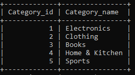
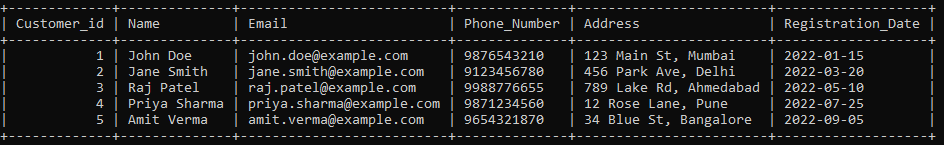
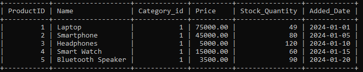
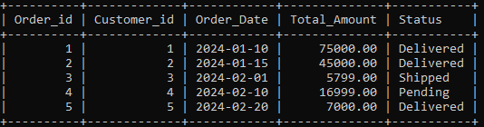
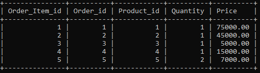
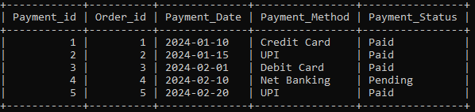
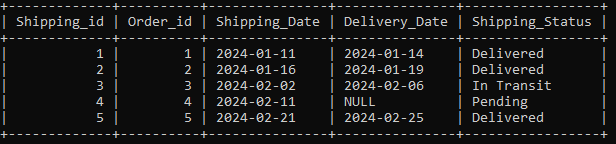

# 🛒 E-Commerce Order Management System


> A fully functional **E-Commerce Order Management System** built using **MySQL**, featuring complete database schema design, sample data, and 12 advanced SQL task implementations covering CRUD, Joins, Subqueries, Window Functions, and more.

---

## 📁 Repository Structure

```
E-Commerce_Order_Management_System/
│
├── 📄 E-Commerce_Order_Management_System_.sql    # Main SQL file (schema + data + queries)
│
├── 📂 Tables/                                    # Screenshots of all table records
│   ├── 🖼️ Category_Table.PNG
│   ├── 🖼️ Customer_Table.PNG
│   ├── 🖼️ Order_Items_Table.PNG
│   ├── 🖼️ Orders_Table.PNG
│   ├── 🖼️ Payment_Table.PNG
│   ├── 🖼️ Product_Table.PNG
│   └── 🖼️ Shipping_Table.PNG
│
├── 📄 README.md                                  # Project documentation (this file)
└── 📄 LICENSE.txt                                # MIT License
```

---

## 🗄️ Database Schema

The system is built around **7 relational tables** with well-defined primary and foreign key constraints:

```
Category ──────────► Product
                         │
Customer ──► Orders ─────┼──► Order_Items
                │
                ├──► Payment
                │
                └──► Shipping
```

---

## 📊 Table Overview

### 🗂️ Category Table
Stores product categories available on the platform.

| Column | Type | Description |
|---|---|---|
| Category_id | INT (PK, AI) | Unique category identifier |
| Category_name | VARCHAR(255) | Name of the category |

**Sample Records:**



---

### 👤 Customer Table
Holds all registered customer information.

| Column | Type | Description |
|---|---|---|
| Customer_id | INT (PK, AI) | Unique customer identifier |
| Name | VARCHAR(255) | Full name of the customer |
| Email | VARCHAR(255) UNIQUE | Customer email address |
| Phone_Number | VARCHAR(20) | Contact number |
| Address | VARCHAR(100) | Shipping/billing address |
| Registration_Date | DATE | Date the customer registered |

**Sample Records:**



---

### 📦 Product Table
Contains all products listed in the store.

| Column | Type | Description |
|---|---|---|
| ProductID | INT (PK, AI) | Unique product identifier |
| Name | VARCHAR(255) | Product name |
| Category_id | INT (FK) | References Category table |
| Price | DECIMAL(10,2) | Product price |
| Stock_Quantity | INT | Available stock |
| Added_Date | DATE | Date product was added |

**Sample Records:**



---

### 🛒 Orders Table
Tracks all customer orders placed on the platform.

| Column | Type | Description |
|---|---|---|
| Order_id | INT (PK, AI) | Unique order identifier |
| Customer_id | INT (FK) | References Customer table |
| Order_Date | DATE | Date the order was placed |
| Total_Amount | DECIMAL(10,2) | Total value of the order |
| Status | VARCHAR(50) | Order status (Delivered/Shipped/Pending/Canceled) |

**Sample Records:**



---

### 🧾 Order_Items Table
Line-item details for each order — which product, how many, and at what price.

| Column | Type | Description |
|---|---|---|
| Order_Item_id | INT (PK, AI) | Unique item identifier |
| Order_id | INT (FK) | References Orders table |
| Product_id | INT (FK) | References Product table |
| Quantity | INT | Number of units ordered |
| Price | DECIMAL(10,2) | Price at the time of ordering |

**Sample Records:**



---

### 💳 Payment Table
Stores payment information for each order.

| Column | Type | Description |
|---|---|---|
| Payment_id | INT (PK, AI) | Unique payment identifier |
| Order_id | INT (FK) | References Orders table |
| Payment_Date | DATE | Date payment was made |
| Payment_Method | VARCHAR(50) | Credit Card / UPI / Debit Card / Net Banking / COD |
| Payment_Status | VARCHAR(50) | Paid / Pending / Refunded |

**Sample Records:**



---

### 🚚 Shipping Table
Tracks shipping and delivery details for each order.

| Column | Type | Description |
|---|---|---|
| Shipping_id | INT (PK, AI) | Unique shipping identifier |
| Order_id | INT (FK) | References Orders table |
| Shipping_Date | DATE | Date the order was dispatched |
| Delivery_Date | DATE (nullable) | Date delivered (NULL if not yet delivered) |
| Shipping_Status | VARCHAR(50) | Delivered / In Transit / Pending / Canceled |

**Sample Records:**



---

## 📝 Sample Data Summary

| Table | Records |
|---|---|
| Category | 5 |
| Product | 20 |
| Customer | 20 |
| Orders | 20 |
| Order_Items | 20 |
| Payment | 20 |
| Shipping | 20 |

---

## ⚙️ SQL Tasks & Functionalities

This project implements **12 core SQL task categories**:

### 1. 🔧 CRUD Operations
- Insert new products, customers, and orders
- Update stock quantity when an order is placed
- Delete canceled orders older than 30 days

### 2. 🔍 SQL Clauses — WHERE, HAVING, LIMIT
- Find all orders placed in the last 6 months
- Get the top 5 highest-priced products
- Find customers who have placed more than 3 orders

### 3. ⚡ SQL Logical Operators — AND, OR, NOT
- Get orders where status is `Pending` AND payment is `Paid`
- Find all products that are NOT out of stock
- Retrieve customers registered after 2022 OR who spent over ₹10,000

### 4. 📊 Sorting & Grouping — ORDER BY, GROUP BY
- List all products sorted by price in descending order
- Display the number of orders placed by each customer

### 5. 🔢 Aggregate Functions — COUNT, SUM, AVG
- Find the total revenue generated by the store
- Identify the most purchased product
- Calculate the average order value

### 6. 🔗 Primary & Foreign Key Relationships
- Enforce `Orders → Customer` relationship using constraints
- Enforce `Payment → Orders` relationship using constraints

### 7. 🤝 SQL Joins
- **INNER JOIN** — Products with their category names
- **LEFT JOIN** — All orders with customer details
- **RIGHT JOIN** — Orders that haven't been shipped
- **FULL OUTER JOIN** (via UNION) — Customers who have never placed an order

### 8. 🔎 Subqueries
- Find orders placed by customers who registered after 2022
- Identify the customer who spent the most
- Get products that have never been ordered

### 9. 📅 Date & Time Functions
- Count orders per month using `MONTH()`
- Calculate delivery time using `DATEDIFF()`
- Format order dates as `DD-MM-YYYY` using `DATE_FORMAT()`

### 10. 🔤 String Functions
- Convert product names to uppercase using `UPPER()`
- Trim whitespace from customer names using `TRIM()`
- Replace NULL emails using `IFNULL()`

### 11. 🪟 Window Functions
- Rank customers by total spending using `RANK() OVER`
- Show cumulative monthly revenue using `SUM() OVER`
- Display running total of orders placed

### 12. 🔀 CASE Statements
- Assign loyalty status: `Gold` / `Silver` / `Bronze` based on spending
- Categorize products as: `Best Seller` / `Popular` / `Regular` based on quantity sold

---

## 🚀 Getting Started

### Prerequisites
- MySQL 8.0 or higher
- MySQL Workbench (recommended) or any MySQL-compatible client

### Installation & Setup

1. **Clone the repository**
   ```bash
   git clone https://github.com/your-username/E-Commerce_Order_Management_System.git
   cd E-Commerce_Order_Management_System
   ```

2. **Open MySQL Workbench** and connect to your local server.

3. **Run the SQL file**
   ```sql
   SOURCE E-Commerce_Order_Management_System_.sql;
   ```
   Or open the file in MySQL Workbench and execute it using **Ctrl + Shift + Enter**.

4. **Verify the database was created**
   ```sql
   USE E_Commerce_Order_Management_System;
   SHOW TABLES;
   ```

---

## 🧪 Key Query Examples

```sql
-- Total Revenue Generated
SELECT SUM(Total_Amount) AS Total_Revenue FROM Orders;

-- Top 5 Most Expensive Products
SELECT * FROM Product ORDER BY Price DESC LIMIT 5;

-- Customer Loyalty Tier
SELECT Customer_id, SUM(Total_Amount) AS Total_Spent,
CASE
    WHEN SUM(Total_Amount) > 50000  THEN 'Gold'
    WHEN SUM(Total_Amount) BETWEEN 20000 AND 50000 THEN 'Silver'
    ELSE 'Bronze'
END AS Loyalty_Status
FROM Orders GROUP BY Customer_id;

-- Cumulative Monthly Revenue (Window Function)
SELECT MONTH(Order_Date) AS Order_Month,
SUM(Total_Amount) AS Monthly_Revenue,
SUM(SUM(Total_Amount)) OVER (ORDER BY MONTH(Order_Date)) AS Cumulative_Revenue
FROM Orders GROUP BY Order_Month;
```

---

## 🏷️ Product Categories Covered

| Category | Products |
|---|---|
| 💻 Electronics | Laptop, Smartphone, Headphones, Smart Watch, Bluetooth Speaker |
| 👕 Clothing | T-Shirt, Jeans, Jacket, Sneakers, Formal Shirt |
| 📚 Books | Python Programming, Data Structures, Clean Code |
| 🏠 Home & Kitchen | Blender, Coffee Maker |
| 🏋️ Sports | Yoga Mat, Cricket Bat, Football, Cycling Helmet, Dumbbells Set |

---

## 🛠️ Tech Stack

| Technology | Purpose |
|---|---|
| **MySQL 8.0** | Relational Database Management |
| **SQL** | Querying, Schema Design, Data Manipulation |
| **MySQL Workbench** | GUI Client for DB management |

---

## 👨‍💻 Author

> Crafted with ❤️ as a complete SQL learning project covering real-world e-commerce database design and query operations.

---

## 📄 License

This project is licensed under the **MIT License** — see the [LICENSE.txt](LICENSE.txt) file for details.

---

*⭐ If you found this project helpful, consider giving it a star on GitHub!*
